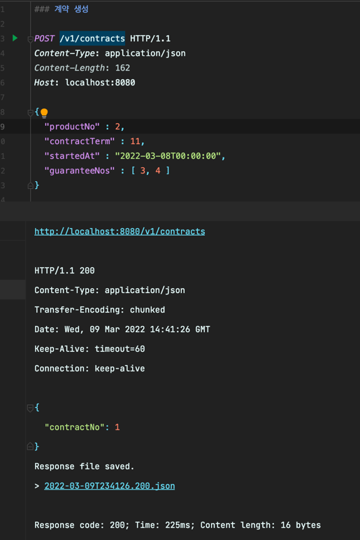
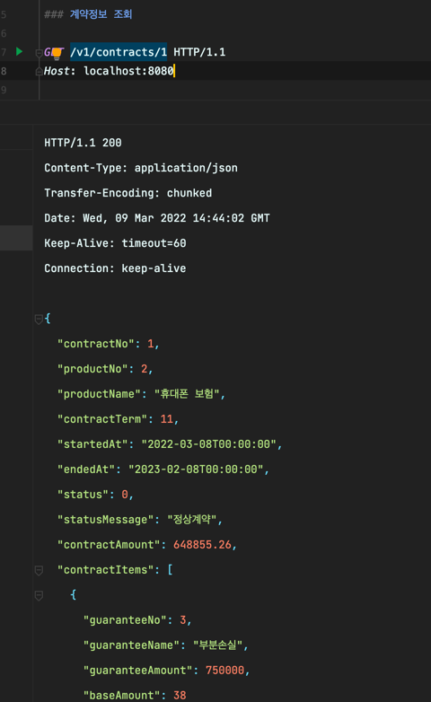
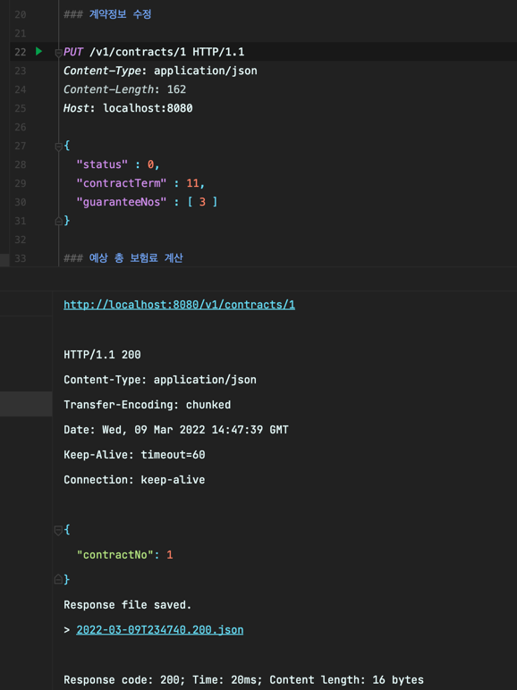
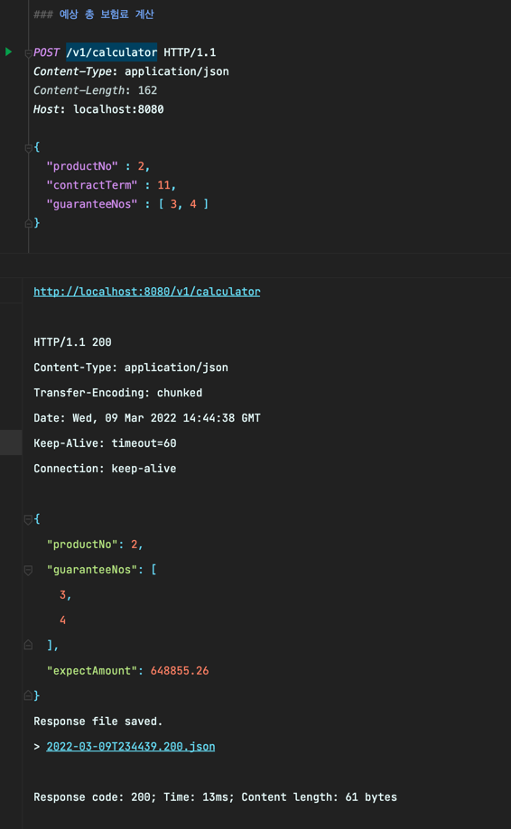

## 빌드 환경

```
Java 11 (11.0.14-zulu)
Gradle
Spring Boot 2.6.4
```

## 프로그램 빌드 및 실행

```
./gradlew clean build
java -jar build/libs/contract-api.jar
```

## API 명세 (RestDocs)

```
http://localhost:8080/docs/index.html
```

## 테스트 방법

### 계약 생성



## 계약 조회



## 계약 정보 수정




## 보험료 계산




## 테스트 코드 실행

```
./gradlew clean test
```

## 고민 및 접근/해결방식
* 계약 번호는 어떻게 채번 할 것인가?
    * 계약 번호가 Auto Increment 로 URL 에 노출되는 경우, 민감한 현재까지의 총 계약 건수가 외부로 노출되는 문제가 있음
    * UUID 를 사용하면 단순하 문제가 해결되지만 정렬에 문제가 생기기 때문에 Snowflake, Timeflake 구현을 고려 하였으나, 민감하지 않은 데이터로 가정하고 Auto Increment 를 사용함
* 보험료 계산은 어떻게 구현 할 것인가?
    * 총 보험료 계산에 발생하는 소수점 계산에 float, double 을 사용하는 경우 부동 소수점 문제가 발생함으로 정확한 계산및 소수점 절사를 위해 내부적으로 십진수를 사용하는 BigDecimal 을 사용하였음.
    * 계약 생성 API 에서 가입기간과 가입담보를 계산해야 하며, 예상보험료 계산 API 에서도 동일한 보험료를 계산해야 함으로 Calculator 라는 계산 도메인을 별도로 분리하고 어떤 API를 통해서 접근 하더라도 같은 보험료가 계산 되도록 구현 하였음.
* 아키텍처는 어떻게 구성 할 것인가?
    * 도메인 로직이 외부 어댑터(웹, 영속성) 로부터 오염되지 않고, 유즈케이스가 추가 되는 경우 기존 코드를 수정 하기보다 새로운 포트와 유즈케이스 코드를 추가 하여 유지보수에 간결한 헥사고날 아키텍처를 사용 하였음
* 계약 상태는 어떻게 구현 할 것인가?
    * 계약상태는 DB에서 enum 필드를 사용하게 되면 상태가 추가 될 때 마다 `ALTER TABLE` 을 사용 해야 하여 운영에 불리함.
    * 따라서 DB에서는 상태값을 int 로 관리 하고, 영속성 엔티티를 도메인 엔티티로 바인딩 하는 과정에서 enum 클래스 ContracStatus (계약상태) 로 바인딩 되어 관리 되도록 구현 하였음.
* 테스트 코드를 어떻게 구현할까?
  * 통합테스트에 `@SpringBootTest` 를 사용하는 경우 어플리케이션 컨텍스트 전체를 구동하기 때문에 테스트가 무거워 지기에  `@WebMvcTest` 를 사용하고 사용하는 서비스는 `@Mockbean` 으로 의존성을 대체 한 뒤 단위 테스트를 분리 하였다.
